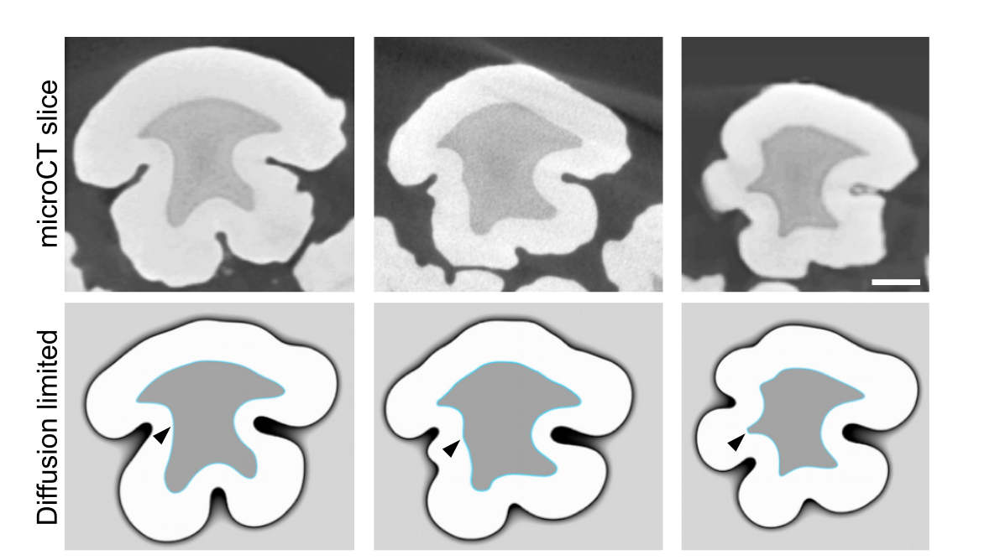

# biomatrix

biomatrix is a computational model of interfacial growth in 2D, where the speed of the growth is assumed to be limited by diffusion of a nutrient substance. The model is motivated by the classical Stefan problem that considers the diffusion-limited phase transition from undercooled liquid to solid.

Detailed description of the model alongside with an application to enamel matrix secretion is presented in Hakkinen et al. (2019, manuscript in preparation).

The Matlab implementation is available under MIT license.

  
  <figcaption> 
  Figure: Mapping dentin shape (light gray) to enamel shape (white) in occlusal plane slices of a pig molar cusp. Top row shows microCT images of real cusp slices, bottom row the simulations of matrix secretion starting from the dentin shape. Scale bar, 1 mm.
  </figcaption>

## Usage

The model is invoked by calling `src/main_matlab.m` with a parameter file and an output folder ID as arguments, see `run_fig1cde.sh` for an example. The parameter file defines the model parameters controlling the growth process, indicates the data file for initializing the spatial domain, and other things such as visualization options.

Shell scripts `run_fig*.sh` run the simulations shown in Hakkinen et al.

